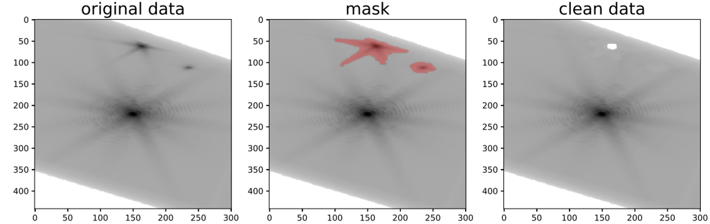
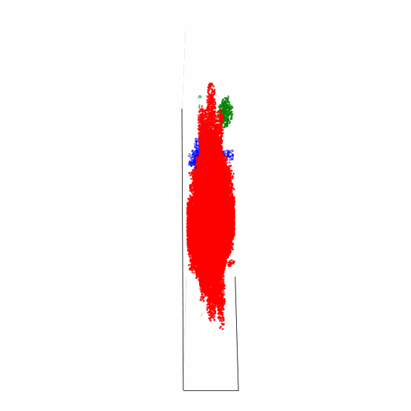

# Alien clustering for BCDI data

## Introduction 

This package use clustering algorithms to find aliens in BCDI data with minimal users input with the following steps :
- **preprocessing** : filter and rescale BCDI data in custom log scale
- **mask creation** : intensity threshold mask and possible smoothing
- **clustering** : clustering using sklearn DBSCAN algorithm
- **filtering** : filter out clusters
- **user cluster selection** : widget selection of the alien cluster from the user
- **alien mask creation** : create the final alien mask and save result 

## Files description
- **plot_utiltities.py** : Some general plotting functions
- **alien_removal_3D_utilities.py** : All functions used for the alien mask creation
- **Alien_removal_notebook.ipynb** : jupyter notebook with a step-by-step procedure to make the alien mask
- **example_data** : folder with BCDi data as a tutorial

## Get started
- clone the repository

    `git clone https://github.com/ewbellec/alienclustering.git`

- open the jupyter notebook Alien_removal_notebook.ipynb
- follow the instructions

## Illustrations

